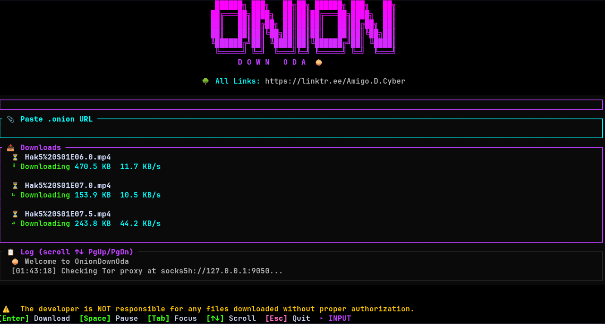

# 🧅 OnionDownOda

> A beautiful, high-performance TUI for downloading files from `.onion` URLs over Tor — built in Rust from Kigali 🇷🇼

[](https://crates.io/crates/oniondownoda)
[](https://aur.archlinux.org/packages/oniondownoda)
[](LICENSE)
[](https://github.com/amigoDcyber/OnionDownOda)

---

## 🖼 Preview



---

## ✨ Features

| Feature | Description |
|---------|-------------|
| 🎨 **Cyberpunk TUI** | Neon magenta/cyan/green aesthetic powered by `ratatui` |
| 🧅 **Tor Native** | SOCKS5 proxy support for `.onion` URLs via `reqwest` |
| ⚡ **Parallel Downloads** | Up to 100 concurrent connections for maximum speed |
| ⏸ **Pause/Resume** | Press `Space` to pause and resume any active download |
| 📊 **Live Progress** | Real-time progress bars with speed, ETA, and byte count |
| 📋 **Activity Log** | Timestamped events with colored status indicators |
| ⚙ **Configurable** | CLI args + optional TOML config file |
| 🌳 **Developer Links** | Linktree visible in UI — copy directly from terminal |
| 📱 **Responsive** | Adapts layout to wide, medium, and narrow terminal sizes |

---

## 🚀 What's New in v2.0.0

### 🔬 Technical Audit & Quality Results

| Category | Status | Details |
|----------|--------|---------|
| Compiler Warnings | ✅ 0 Warnings | All unused imports and dead code pragmas resolved |
| Clippy Linting | ✅ Pass | Fixed redundant closures, matches macro, and import paths |
| Code Style | ✅ Idiomatic | Fully formatted to standard Rust styles using `cargo fmt` |
| Build Stability | ✅ v2.0.0 | Verified via `cargo publish --dry-run` |

### 🐛 Known Limitations Resolved

- **403 Forbidden Errors** — Now explicitly handled and logged when servers (like Cloudflare) block automated requests.
- **File Clashes** — Downloads with the same name now automatically increment (e.g., `file (1).zip`).
- **Global Pausing** — Fixed the bug where pausing one download would break the entire HTTP pipeline for others.

---

## 📦 Installation

### Prerequisites

- **Tor** — must be running on your system before launching the app

#### Install & Start Tor

```bash
# Arch Linux / Garuda / Manjaro
sudo pacman -S tor
sudo systemctl enable --now tor

# Ubuntu / Debian
sudo apt install tor
sudo systemctl enable --now tor

# Fedora
sudo dnf install tor
sudo systemctl enable --now tor

# macOS
brew install tor
brew services start tor
```

---

### Via crates.io *(Recommended)*

```bash
cargo install oniondownoda
```

> Requires Rust 1.70+ — install via [rustup.rs](https://rustup.rs/)

---

### Via AUR *(Arch / Garuda / Manjaro)*

```bash
yay -S oniondownoda
# or
paru -S oniondownoda
```

---

### Via GitHub Releases *(No Rust required)*

Download the pre-built binary for your platform from the [Releases page](https://github.com/amigoDcyber/OnionDownOda/releases/latest):

```bash
# After downloading, make it executable
chmod +x oniondownoda
./oniondownoda
```

---

### Build from Source

```bash
git clone https://github.com/amigoDcyber/OnionDownOda.git
cd OnionDownOda
cargo build --release
./target/release/oniondownoda
```

---

## 🚀 Usage

```bash
# Run with defaults (Tor at 127.0.0.1:9050)
oniondownoda

# Custom Tor proxy (e.g., Tor Browser on port 9150)
oniondownoda --proxy socks5h://127.0.0.1:9150

# Custom output directory
oniondownoda --output-dir ~/Downloads/onion

# Verbose logging
oniondownoda --verbose
```

---

## ⌨ Keyboard Shortcuts

| Key | Action |
|:---:|--------|
| `Enter` | Start download from URL input |
| `Tab` | Switch focus between Input and Downloads |
| `Space` | Pause / Resume selected download |
| `↑` / `↓` | Scroll downloads or log |
| `PgUp` / `PgDn` | Scroll log faster |
| `Esc` | Quit |
| `Ctrl+C` | Force quit |

---

## ⚙ Configuration

Config file location:
- **Linux/macOS:** `~/.config/oniondownoda/config.toml`
- **Windows:** `%APPDATA%\oniondownoda\config.toml`

```toml
# Tor SOCKS5 proxy
proxy = "socks5h://127.0.0.1:9050"

# Output directory for downloads
output_dir = "~/Downloads"

# Enable verbose logging
verbose = true
```

**Priority:** CLI args → Config file → Defaults

---

## 🔧 Download States

| State | Icon | Description |
|-------|:----:|-------------|
| In Progress | ⏳ | Actively downloading with live progress bar |
| Paused | ⏸ | Paused — press `Space` to resume |
| Completed | ✅ | Finished successfully |
| Failed | ❌ | Error occurred — check log for details |

---

## 🛠 Tor Troubleshooting

If you see `● Disconnected` in the status bar:

```bash
# Check if Tor is running
sudo systemctl status tor

# Test connectivity
curl --socks5-hostname 127.0.0.1:9050 https://check.torproject.org/api/ip

# Restart Tor
sudo systemctl restart tor
```

---

## 🏗 Architecture

| Module | Purpose |
|--------|---------|
| `main.rs` | Entry point, terminal setup, async event loop |
| `app.rs` | App state machine, input handling, download tracking |
| `ui.rs` | TUI rendering — banner, panels, progress bars, credits |
| `banner.rs` | ASCII art branding |
| `downloader.rs` | Parallel HTTP download engine with chunk support |
| `tor.rs` | SOCKS5 connectivity check and reqwest client builder |
| `config.rs` | CLI args (clap) + TOML config merging |
| `error.rs` | Error types with user-friendly messages |

---

## 👤 Developer

**Amigo D. Cyber** — Cybersecurity enthusiast & Rust developer from Kigali, Rwanda 🇷🇼

| Platform | Link |
|----------|------|
| 🐙 GitHub | [@amigoDcyber](https://github.com/amigoDcyber) |
| 🌳 All Links | [linktr.ee/Amigo.D.Cyber](https://linktr.ee/Amigo.D.Cyber) |

---

## 📄 License

MIT License — see [LICENSE](LICENSE) for details.

---

## 🤝 Contributing

PRs, issues, and forks are welcome. If you find a bug or want a feature, open an issue on GitHub.

---

## ⚠ Disclaimer

This tool is for **educational and research purposes only**. Users are solely responsible for complying with local laws and the terms of service of any site accessed via Tor. **The developer assumes no liability for any files downloaded without proper authorization.**
